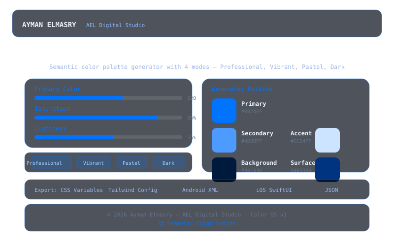

# AEL Color OS

  

**Semantic color palette generator** with 4 professional modes — Professional, Vibrant, Pastel, and Dark. Generate, preview, and export consistent design tokens.

## Features

- **4 Modes**: Professional (balanced), Vibrant (bold), Pastel (soft), Dark (low-light)
- **HSL Controls**: Interactive sliders for hue, saturation, and lightness
- **Smart Palette**: Generates Primary, Secondary, Accent, Background, and Surface colors
- **5 Export Formats**: CSS Variables, Tailwind Config, Android XML, iOS SwiftUI, JSON
- **Real-time Preview**: Color swatches update instantly
- **One-Click Copy**: Copy hex values directly
- **Semantic Engine**: Algorithmically generates color hierarchies
- **Glassmorphism UI**: Dark theme with blue (#0074FF) accents

## Tech Stack

- **HTML5** — Semantic structure
- **CSS3** — Glassmorphism, custom properties, grid layout
- **JavaScript** — HSL engine, palette generation, 5 export formatters
- **Deployment**: GitHub Pages

## Live Demo

https://aymanelmasryael.github.io/ael-color-os/

## Usage

1. Choose a mode (Professional, Vibrant, Pastel, Dark)
2. Adjust HSL sliders to tune the primary color
3. Preview the generated 5-color palette
4. Copy individual colors or export in your preferred format
5. Use the tokens directly in your project

## Author

**Ayman Elmasry** — AEL Digital Studio

---

_© 2026 AEL Digital Studio. All rights reserved._
